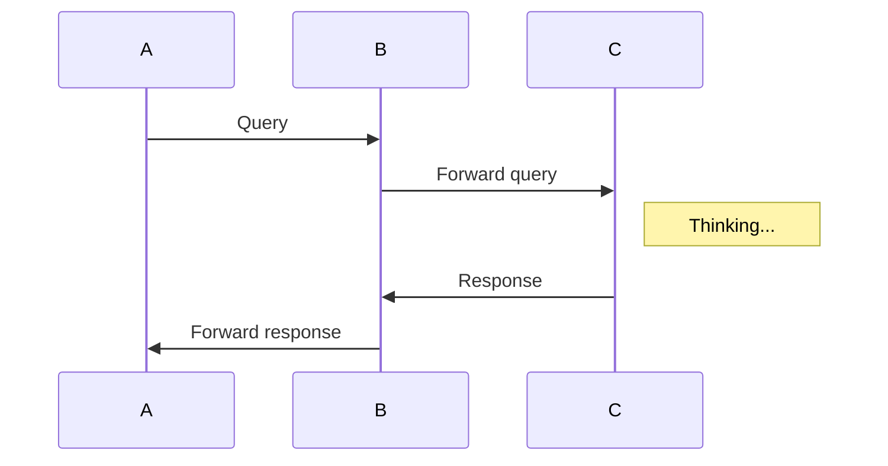

# 使用markdown制作ppt

## 基于Marp

- Marp, Markdown Presentation Ecosystem.
- Provide the great experience to create beautiful slide deck

--- 

# 使用Vscode编写Markdown

## 基于Marp for vscode

- vscode非常的好用
- markdown写起来非常简单
- Typora更加好用一些

---

# 在markdown中插入图片

## 使用picGo和阿里云OSS作为图床

- 这是一张图片示例
  

---

# 在markdown中插入代码

## 使用C++进行书写

```cpp
#include<iostream>
using namespace std;
int main(){
    cout << "Hello world" << endl;

    return 0;
}
```

## 使用python进行书写

```python
print("Hello world", end='')
```

---

# 在markdown中插入引用和公式

## 插入引用块

> 著名计算机科学家frozenwhale在2000年8月21日出生。擅长使用T语言，目前该语言在全世界范围内流行。


## 插入公式

我们给定函数$f(x)$以及其原函数$F(X)$，有如下公式成立：

$$\int_{-\infty}^{+\infty}f(x)dx=F(x)$$

---

# 使用markdown绘制流程图
## 简单流程图的绘制

